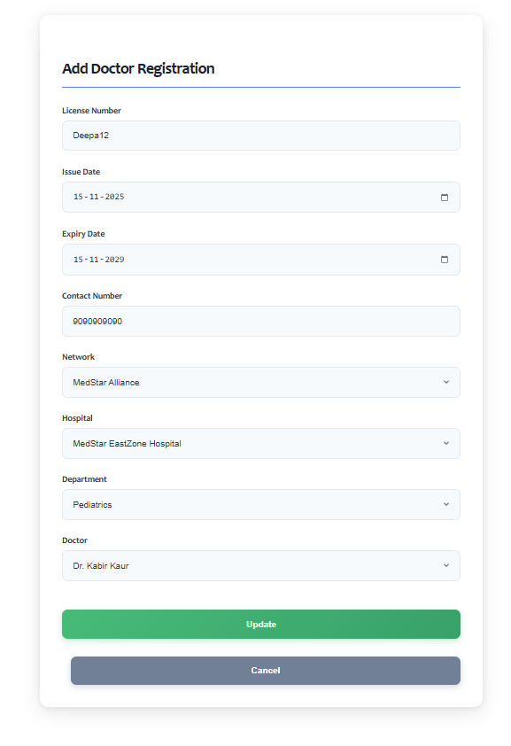
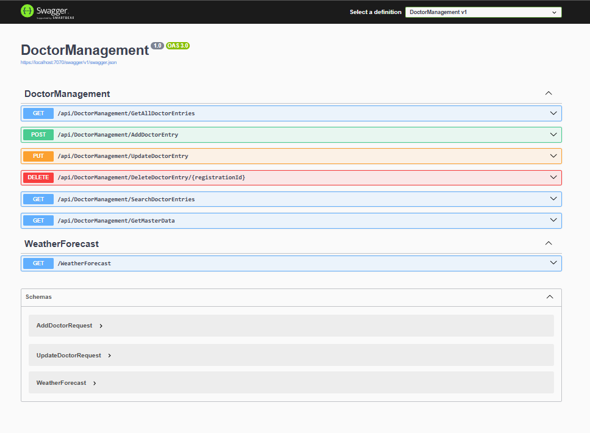
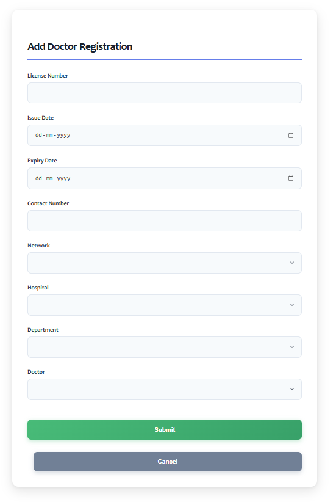

# Doctor Management System

A full‑stack **Hospital Doctor Management System** built using **Angular 15 (Frontend)** and **ASP.NET Core Web API (Backend)** with SQL Server. This project demonstrates CRUD operations, cascading dropdowns, search functionality, edit mode, and a clean architecture.

---

## 🚀 Features

### **🔹 Frontend (Angular)**

* Responsive UI with Bootstrap
* Add, Edit, View Doctors
* Cascading dropdowns:

  * Network → Hospital → Department → Doctor
* Search doctors by name
* Edit mode with prefilled form
* Angular services for API communication

### **🔹 Backend (ASP.NET Core Web API)**

* Clean Controller → BLL → DAL architecture
* Stored Procedure based data access
* Endpoints:

  * `GetAllDoctorEntries`
  * `GetDoctorById`
  * `GetNetworks`, `GetHospitalsByNetwork`, `GetDepartmentsByHospital`, `GetDoctorsByDepartment`
  * `AddDoctor`, `UpdateDoctor`
* Robust error handling + responses

### **🔹 Database (SQL Server)**

* Well‑structured tables:

  * `Doctors`
  * `Hospitals`
  * `Networks`
  * `Departments`
* Stored Procedures for full CRUD operations

---

## 🧱 Project Images


 
 




## 🧱 Project Architecture

```
/DoctorManagementSystem
│
├── /frontend  (Angular)
│   ├── components
│   ├── services
│   └── models
│
└── /backend (ASP.NET Core API)
    ├── Controllers
    ├── BLL (Business Logic Layer)
    ├── DAL (Data Access Layer)
    ├── Repository
    └── Models
```

---

## 📌 Tech Stack

### **Frontend:**

* Angular 15
* Bootstrap 5
* TypeScript

### **Backend:**

* ASP.NET Core Web API
* C#
* ADO.NET

### **Database:**

* SQL Server
* Stored Procedures

---

## ⚙️ Installation & Setup

### **1️⃣ Clone the repository**

```bash
git clone https://github.com/DeepankSingh/DoctorManagementSystem.git
```

---

## 🖥️ Setting up Backend (ASP.NET Core API)

1. Open `/backend` in Visual Studio
2. Update `appsettings.json` with your SQL connection string
3. Run the database scripts to create tables + stored procedures
4. Start API:

```bash
dotnet run
```

API will run at `https://localhost:5001`.

---

## 🌐 Setting up Frontend (Angular)

1. Navigate to `/frontend`
2. Install dependencies:

```bash
npm install
```

3. Start the Angular app:

```bash
ng serve -o
```

Angular will run at: `http://localhost:4200`

---

## 📸 Screenshots (Add Your Own)

* Add Doctor Form
* Cascading Dropdowns
* Doctor List with Search
* Edit Mode

---

## 🛠️ API Endpoints (Examples)

### ✔ Get All Doctors

```
GET /api/DoctorManagement/GetAllDoctorEntries
```

### ✔ Get Doctor by ID

```
GET /api/DoctorManagement/GetDoctorById/{id}
```

### ✔ Cascading Dropdown APIs

```
GET /api/DoctorManagement/GetNetworks
GET /api/DoctorManagement/GetHospitalsByNetwork?networkId=1
GET /api/DoctorManagement/GetDepartmentsByHospital?hospitalId=10
GET /api/DoctorManagement/GetDoctorsByDepartment?departmentId=8
```

### ✔ Add Doctor

```
POST /api/DoctorManagement/AddDoctor
```

### ✔ Update Doctor

```
PUT /api/DoctorManagement/UpdateDoctor
```

---

## 🤝 Contributing

Pull requests are welcome! For major changes, please open an issue first.

---

## 📄 License

This project is for educational and demonstration purposes.

---

## 🌟 Show Your Support

If you like this project, please ⭐ the repo on GitHub!

---

## 📬 Contact

For queries or collaboration — feel free to connect!

**Developer:** Deepank
